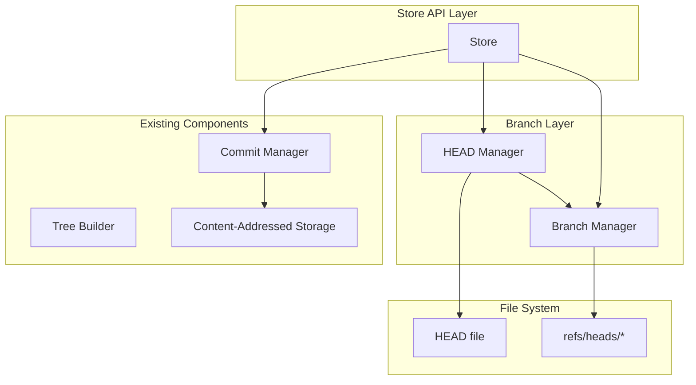

# Design Document: Branching for MicroProlly

## Overview

This document describes the design for adding branching support to MicroProlly. Branching enables parallel lines of development by providing named, mutable references to commits. The design follows Git's branching model where branches are lightweight pointers stored as files.

The implementation is divided into two layers:
1. **Branch Manager**: Low-level branch operations (create, delete, list, get)
2. **Store API Integration**: High-level operations that integrate branching with the existing Store

## Architecture



## Components and Interfaces

### 1. Branch Manager

```go
// BranchManager handles branch operations
type BranchManager struct {
    refsDir string  // Path to refs/heads/ directory
}

// BranchManager interface
type BranchManagerInterface interface {
    // CreateBranch creates a new branch pointing to the given commit
    CreateBranch(name string, commitHash types.Hash) error
    
    // GetBranch returns the commit hash a branch points to
    GetBranch(name string) (types.Hash, error)
    
    // DeleteBranch removes a branch
    DeleteBranch(name string) error
    
    // ListBranches returns all branch names
    ListBranches() ([]string, error)
    
    // UpdateBranch updates a branch to point to a new commit
    UpdateBranch(name string, commitHash types.Hash) error
    
    // BranchExists checks if a branch exists
    BranchExists(name string) bool
}
```

### 2. HEAD Manager

```go
// HeadState represents the current HEAD state
type HeadState struct {
    IsDetached bool
    Branch     string     // Branch name if attached
    CommitHash types.Hash // Commit hash (always set)
}

// HeadManager handles HEAD state
type HeadManager struct {
    headFile      string
    branchManager *BranchManager
}

// HeadManager interface
type HeadManagerInterface interface {
    // GetHead returns the current HEAD state
    GetHead() (*HeadState, error)
    
    // SetHeadToBranch sets HEAD to point to a branch
    SetHeadToBranch(branchName string) error
    
    // SetHeadToCommit sets HEAD to a detached state pointing to a commit
    SetHeadToCommit(commitHash types.Hash) error
    
    // GetHeadCommit returns the commit hash HEAD points to
    GetHeadCommit() (types.Hash, error)
}
```

### 3. Extended Store Interface

```go
// Store additions for branching
type Store interface {
    // Existing methods...
    
    // Branch operations
    CreateBranch(name string) error
    CreateBranchAt(name string, commitHash types.Hash) error
    SwitchBranch(name string) error
    DeleteBranch(name string) error
    ListBranches() ([]string, error)
    CurrentBranch() (string, bool, error)  // name, isDetached, error
    
    // HEAD operations
    DetachHead(commitHash types.Hash) error
}
```

## Data Models

### On-Disk Layout

```
<data_dir>/
├── objects/           # Content-addressed storage (existing)
│   └── ...
├── HEAD               # Current HEAD reference
└── refs/
    └── heads/         # Branch references
        ├── main       # Default branch
        ├── feature-x  # Example branch
        └── ...
```

### HEAD File Format

**Attached HEAD (pointing to branch):**
```
ref: refs/heads/main
```

**Detached HEAD (pointing to commit):**
```
a1b2c3d4e5f6789...  (64 hex characters)
```

### Branch Reference File Format

Each file in `refs/heads/` contains a single line with the commit hash:
```
a1b2c3d4e5f6789...  (64 hex characters)
```

### Branch Name Validation Rules

Valid branch names must:
- Be non-empty
- Not contain spaces, `~`, `^`, `:`, `?`, `*`, `[`, `\`
- Not start with `-` or `.`
- Not end with `.lock`
- Not contain `..` or `//`
- Not be the reserved name `HEAD`

## Correctness Properties

*A property is a characteristic or behavior that should hold true across all valid executions of a system-essentially, a formal statement about what the system should do. Properties serve as the bridge between human-readable specifications and machine-verifiable correctness guarantees.*

### Property 1: Branch Creation Round-Trip
*For any* valid branch name and commit hash, creating a branch and then getting it SHALL return the same commit hash.
**Validates: Requirements 1.1, 1.2, 2.2**

### Property 2: Branch Listing Completeness
*For any* set of created branches, `ListBranches()` SHALL return exactly those branch names (no more, no less).
**Validates: Requirements 2.1**

### Property 3: Invalid Branch Name Rejection
*For any* invalid branch name (empty, contains invalid characters, etc.), `CreateBranch()` SHALL return an error.
**Validates: Requirements 1.4**

### Property 4: Branch Deletion Removes Branch
*For any* existing branch that is not the current branch, after `DeleteBranch()`, the branch SHALL no longer appear in `ListBranches()` and `GetBranch()` SHALL return an error.
**Validates: Requirements 4.1, 4.4**

### Property 5: Switch Branch Updates Working State
*For any* branch with committed data, after `SwitchBranch()`, the working state SHALL match the data at that branch's commit.
**Validates: Requirements 3.1, 3.3**

### Property 6: Current Branch Tracking
*For any* branch switch operation, `CurrentBranch()` SHALL return the name of the branch that was switched to.
**Validates: Requirements 2.4**

### Property 7: Commit Advances Branch
*For any* commit made while HEAD points to a branch, that branch SHALL be updated to point to the new commit.
**Validates: Requirements 5.1**

### Property 8: Detached Commit Preserves Branches
*For any* commit made while HEAD is detached, all existing branches SHALL remain unchanged.
**Validates: Requirements 5.2**

### Property 9: Persistence Round-Trip
*For any* set of branches and HEAD state, closing and reopening the store SHALL restore the same branches and HEAD state.
**Validates: Requirements 6.1, 6.3**

### Property 10: HEAD File Format Correctness
*For any* HEAD state (attached or detached), the HEAD file SHALL contain the correct format ("ref: refs/heads/{name}" for attached, raw hash for detached).
**Validates: Requirements 7.1, 7.2**

### Property 11: Detach Head Sets Correct State
*For any* valid commit hash, after `DetachHead()`, HEAD SHALL be in detached state pointing to that commit.
**Validates: Requirements 7.3**

## Error Handling

### Error Types

```go
var (
    ErrBranchExists       = errors.New("branch already exists")
    ErrBranchNotFound     = errors.New("branch not found")
    ErrInvalidBranchName  = errors.New("invalid branch name")
    ErrCannotDeleteCurrent = errors.New("cannot delete the current branch")
    ErrDetachedHead       = errors.New("HEAD is in detached state")
)
```

### Error Handling Strategy

1. **Branch Name Validation**: Validate before any file operations
2. **Atomic Writes**: Use temp file + rename pattern for all branch updates
3. **Existence Checks**: Check branch existence before operations that require it
4. **Current Branch Protection**: Prevent deletion of checked-out branch

## Testing Strategy

### Property-Based Testing Library

The project will continue using **rapid** (`pgregory.net/rapid`) for property-based testing.

### Test Configuration

- Each property-based test SHALL run a minimum of **100 iterations**
- Tests SHALL use deterministic seeds for reproducibility when debugging
- Each property test SHALL be tagged with a comment referencing the design property

### Unit Tests

Unit tests will cover:
- Branch name validation (valid and invalid names)
- HEAD file parsing (attached and detached formats)
- Error conditions (duplicate branch, delete current, etc.)

### Property-Based Tests

Each correctness property will have a corresponding property-based test:

1. **Generators**: Custom generators for:
   - Valid branch names
   - Invalid branch names
   - Random commit sequences
   - Random branch operations

2. **Test Structure**:
   ```go
   func TestProperty_BranchCreationRoundTrip(t *testing.T) {
       // **Feature: branching, Property 1: Branch Creation Round-Trip**
       rapid.Check(t, func(t *rapid.T) {
           branchName := genValidBranchName().Draw(t, "branch_name")
           // ... test implementation
       })
   }
   ```

### Integration Tests

Integration tests will verify:
- End-to-end workflows (create branch → commit → switch → verify)
- Persistence (create branches, close, reopen, verify)
- Interaction with existing commit/checkout operations

