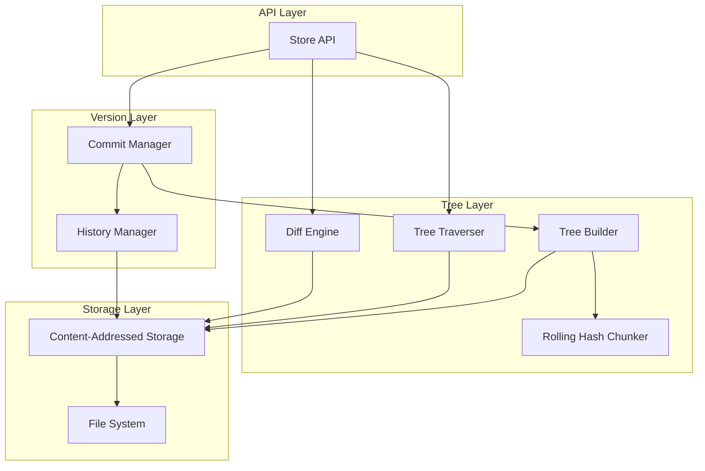

# Design Document: MicroProlly

## Overview

This document describes the design of MicroProlly, a versioned key-value store implemented in Go. The system provides Git-like version control for data using a Prolly Tree (Probabilistic B-Tree) as the core data structure. The Prolly Tree combines B-Tree efficiency with Merkle Tree properties through content-based chunking via rolling hash.

The architecture follows a layered approach:
1. **Storage Layer**: Content-addressed storage (CAS) for persistence
2. **Tree Layer**: Prolly Tree construction and traversal
3. **Version Layer**: Commits, history, and time-travel queries
4. **API Layer**: User-facing operations (Put, Get, Commit, Diff, etc.)

## Architecture



## Components and Interfaces

### 1. Content-Addressed Storage (CAS)

```go
// CAS provides content-addressed storage operations
type CAS interface {
    // Write stores data and returns its SHA-256 hash
    Write(data []byte) (Hash, error)
    
    // Read retrieves data by its hash
    Read(hash Hash) ([]byte, error)
    
    // Exists checks if a hash exists in storage
    Exists(hash Hash) bool
    
    // Close releases resources
    Close() error
}

// Hash represents a SHA-256 hash (32 bytes)
type Hash [32]byte
```

### 2. Rolling Hash Chunker

```go
// Chunker splits data into content-defined chunks
type Chunker interface {
    // Chunk takes sorted KV pairs and returns chunk boundaries
    Chunk(pairs []KVPair) [][]KVPair
}

// BuzhashChunker implements content-defined chunking using Buzhash
type BuzhashChunker struct {
    // TargetSize is the average chunk size (e.g., 4096)
    TargetSize uint32
    // MinSize prevents tiny chunks
    MinSize uint32
    // MaxSize prevents huge chunks
    MaxSize uint32
}
```

### 3. Prolly Tree Nodes

```go
// Node represents a node in the Prolly Tree
type Node interface {
    // Hash returns the content hash of this node
    Hash() Hash
    // Serialize converts the node to bytes
    Serialize() ([]byte, error)
    // IsLeaf returns true for leaf nodes
    IsLeaf() bool
}

// LeafNode contains actual key-value pairs
type LeafNode struct {
    Pairs []KVPair
}

// InternalNode contains references to child nodes
type InternalNode struct {
    // Children maps the first key of each child to its hash
    Children []ChildRef
}

// ChildRef represents a reference to a child node
type ChildRef struct {
    Key  []byte
    Hash Hash
}

// KVPair represents a key-value pair
type KVPair struct {
    Key   []byte
    Value []byte
}
```

### 4. Tree Builder

```go
// TreeBuilder constructs Prolly Trees from sorted KV pairs
type TreeBuilder interface {
    // Build creates a tree and returns the root hash
    Build(pairs []KVPair) (Hash, error)
}
```

### 5. Tree Traverser

```go
// TreeTraverser provides tree navigation operations
type TreeTraverser interface {
    // Get retrieves a value by key from a tree rooted at the given hash
    Get(rootHash Hash, key []byte) ([]byte, error)
    
    // GetAll returns all KV pairs in the tree (for iteration)
    GetAll(rootHash Hash) ([]KVPair, error)
}
```

### 6. Diff Engine

```go
// DiffEngine computes differences between tree versions
type DiffEngine interface {
    // Diff returns changes between two tree roots
    Diff(hashA, hashB Hash) (DiffResult, error)
}

// DiffResult contains the differences between two versions
type DiffResult struct {
    Added    []KVPair  // Keys present in B but not A
    Modified []KVPair  // Keys with different values
    Deleted  [][]byte  // Keys present in A but not B
}
```

### 7. Commit Manager

```go
// Commit represents a snapshot of the database
type Commit struct {
    RootHash  Hash      `json:"root_hash"`
    Message   string    `json:"message"`
    Parent    Hash      `json:"parent"`
    Timestamp int64     `json:"timestamp"`
}

// CommitManager handles commit operations
type CommitManager interface {
    // CreateCommit creates a new commit with the given root and message
    CreateCommit(rootHash Hash, message string, parent Hash) (*Commit, Hash, error)
    
    // GetCommit retrieves a commit by its hash
    GetCommit(hash Hash) (*Commit, error)
    
    // Log returns the commit history from a given commit
    Log(hash Hash) ([]*Commit, error)
}
```

### 8. Store (Main API)

```go
// Store is the main user-facing interface
type Store interface {
    // Put stores a key-value pair in the working state
    Put(key, value []byte) error
    
    // Get retrieves a value from the current working state
    Get(key []byte) ([]byte, error)
    
    // GetAt retrieves a value as it existed at a specific commit
    GetAt(key []byte, commitHash Hash) ([]byte, error)
    
    // Delete removes a key from the working state
    Delete(key []byte) error
    
    // Commit creates a new commit with the current state
    Commit(message string) (Hash, error)
    
    // Checkout sets the working state to a specific commit
    Checkout(commitHash Hash) error
    
    // Diff compares two commits
    Diff(hashA, hashB Hash) (DiffResult, error)
    
    // Log returns commit history
    Log() ([]*Commit, error)
    
    // Close releases resources
    Close() error
}
```

## Data Models

### On-Disk Layout

```
<data_dir>/
├── objects/           # Content-addressed storage
│   ├── a1/
│   │   └── b2c3d4...  # Object files named by hash
│   └── ...
├── HEAD               # Current commit hash
└── refs/
    └── main           # Branch reference (future extension)
```

### Node Serialization Format

Nodes are serialized using a simple binary format for determinism:

**Leaf Node:**
```
[1 byte: node type = 0x01]
[4 bytes: pair count (big-endian)]
For each pair:
  [4 bytes: key length]
  [N bytes: key]
  [4 bytes: value length]
  [M bytes: value]
```

**Internal Node:**
```
[1 byte: node type = 0x02]
[4 bytes: child count (big-endian)]
For each child:
  [4 bytes: key length]
  [N bytes: key]
  [32 bytes: child hash]
```

### Commit Serialization

Commits are serialized as JSON for human readability:

```json
{
  "root_hash": "a1b2c3d4e5f6...",
  "message": "Added user data",
  "parent": "f6e5d4c3b2a1...",
  "timestamp": 1733580000
}
```

## Correctness Properties

*A property is a characteristic or behavior that should hold true across all valid executions of a system-essentially, a formal statement about what the system should do. Properties serve as the bridge between human-readable specifications and machine-verifiable correctness guarantees.*

### Property 1: KV Put-Get Round-Trip
*For any* valid key and value, if `Put(key, value)` succeeds, then `Get(key)` SHALL return the same value.
**Validates: Requirements 1.1, 1.2**

### Property 2: KV Delete Removes Key
*For any* key that exists in the store, after `Delete(key)` succeeds, `Get(key)` SHALL return a "key not found" error.
**Validates: Requirements 1.4**

### Property 3: Chunk Boundary Stability
*For any* sorted set of KV pairs and any single key insertion, the Rolling_Hash_Chunker SHALL produce identical chunk boundaries for all regions not containing the inserted key.
**Validates: Requirements 2.3**

### Property 4: KV Pair Serialization Determinism
*For any* set of KV pairs, serializing them multiple times SHALL produce identical byte sequences.
**Validates: Requirements 2.4**

### Property 5: KV Pair Serialization Round-Trip
*For any* set of KV pairs, serializing then deserializing SHALL produce an equivalent set of pairs.
**Validates: Requirements 2.5**

### Property 6: Tree Construction Determinism
*For any* sorted set of KV pairs, building a Prolly Tree multiple times SHALL produce identical root hashes.
**Validates: Requirements 3.4**

### Property 7: CAS Write-Read Round-Trip
*For any* byte sequence, `Write(data)` followed by `Read(hash)` SHALL return the original data, and writing the same data twice SHALL return the same hash.
**Validates: Requirements 4.1, 4.2, 4.3, 4.5**

### Property 8: Commit Structure Completeness
*For any* commit created via `Commit(message)`, the commit object SHALL contain a valid root hash, the provided message, a timestamp, and the parent commit hash.
**Validates: Requirements 5.1, 5.2**

### Property 9: Commit History Chain Integrity
*For any* sequence of N commits, `Log()` SHALL return exactly N commits in reverse chronological order, with each commit's parent matching the previous commit's hash.
**Validates: Requirements 5.3**

### Property 10: Commit Serialization Round-Trip
*For any* commit object, serializing to JSON then deserializing SHALL produce an equivalent commit object.
**Validates: Requirements 5.5**

### Property 11: Time-Travel Get Correctness
*For any* key-value pair that existed at commit C, `GetAt(key, C)` SHALL return the value as it was at commit C, regardless of subsequent modifications.
**Validates: Requirements 6.1**

### Property 12: Checkout Restores State
*For any* commit C, after `Checkout(C)`, the working state SHALL match the state at commit C (all keys and values identical).
**Validates: Requirements 6.4**

### Property 13: Diff Correctness
*For any* two commits A and B, `Diff(A, B)` SHALL return exactly the keys that were added, modified, or deleted between A and B.
**Validates: Requirements 7.1**

### Property 14: Identical Trees Have Empty Diff
*For any* two commits with identical root hashes, `Diff(A, B)` SHALL return an empty diff result.
**Validates: Requirements 7.2**

### Property 15: Structural Sharing Efficiency
*For any* tree with N nodes, after modifying a single key, the new tree SHALL share at least (N - log(N)) nodes with the original tree.
**Validates: Requirements 8.1, 8.2, 8.3**

### Property 16: Persistence Across Restarts
*For any* store with committed data, closing and reopening the store SHALL restore the HEAD commit and all accessible history.
**Validates: Requirements 9.2**

### Property 17: Node Serialization Determinism
*For any* node (leaf or internal), serializing it multiple times SHALL produce identical byte sequences.
**Validates: Requirements 10.1, 10.2, 10.4**

### Property 18: Node Serialization Round-Trip
*For any* node (leaf or internal), serializing then deserializing SHALL produce an equivalent node with identical content.
**Validates: Requirements 10.3**

## Error Handling

### Error Types

```go
var (
    ErrKeyNotFound    = errors.New("key not found")
    ErrCommitNotFound = errors.New("commit not found")
    ErrHashNotFound   = errors.New("hash not found in storage")
    ErrCorruptedData  = errors.New("data corruption detected")
    ErrInvalidKey     = errors.New("invalid key: empty keys not allowed")
)
```

### Error Handling Strategy

1. **Storage Errors**: CAS operations return wrapped errors with context (hash, operation type)
2. **Tree Errors**: Node deserialization validates checksums and returns `ErrCorruptedData` on mismatch
3. **API Errors**: User-facing methods return typed errors for programmatic handling
4. **Panic Recovery**: Internal panics are caught and converted to errors at API boundaries

## Testing Strategy

### Property-Based Testing Library

The project will use **rapid** (`pgregory.net/rapid`) for property-based testing in Go. Rapid provides:
- Automatic shrinking of failing examples
- Stateful testing support
- Good integration with Go's testing package

### Test Configuration

- Each property-based test SHALL run a minimum of **100 iterations**
- Tests SHALL use deterministic seeds for reproducibility when debugging
- Each property test SHALL be tagged with a comment referencing the design property

### Unit Tests

Unit tests will cover:
- Edge cases: empty keys, empty values, single-element trees
- Error conditions: missing keys, invalid hashes, corrupted data
- Boundary conditions: chunk size boundaries, tree depth limits

### Property-Based Tests

Each correctness property from the design will have a corresponding property-based test:

1. **Generators**: Custom generators for:
   - Random byte slices (keys and values)
   - Random KV pair sets (sorted, unique keys)
   - Random tree structures
   - Random commit sequences

2. **Test Structure**:
   ```go
   func TestProperty_KVPutGetRoundTrip(t *testing.T) {
       // **Feature: versioned-kv-store, Property 1: KV Put-Get Round-Trip**
       rapid.Check(t, func(t *rapid.T) {
           key := rapid.SliceOf(rapid.Byte()).Draw(t, "key")
           value := rapid.SliceOf(rapid.Byte()).Draw(t, "value")
           // ... test implementation
       })
   }
   ```

### Integration Tests

Integration tests will verify:
- End-to-end workflows (put → commit → time-travel → diff)
- Persistence (write, close, reopen, verify)
- Concurrent read access (single writer, multiple readers)

