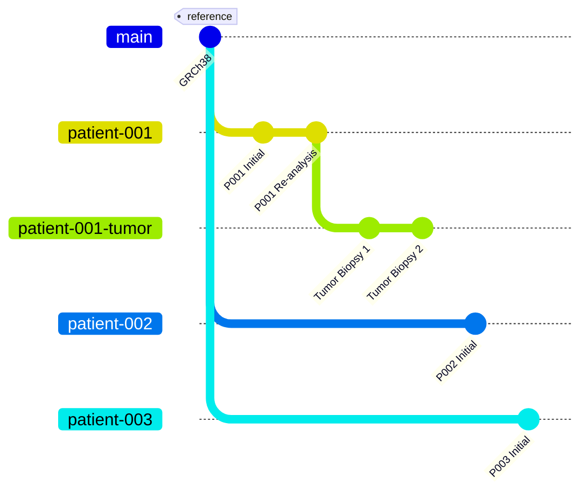
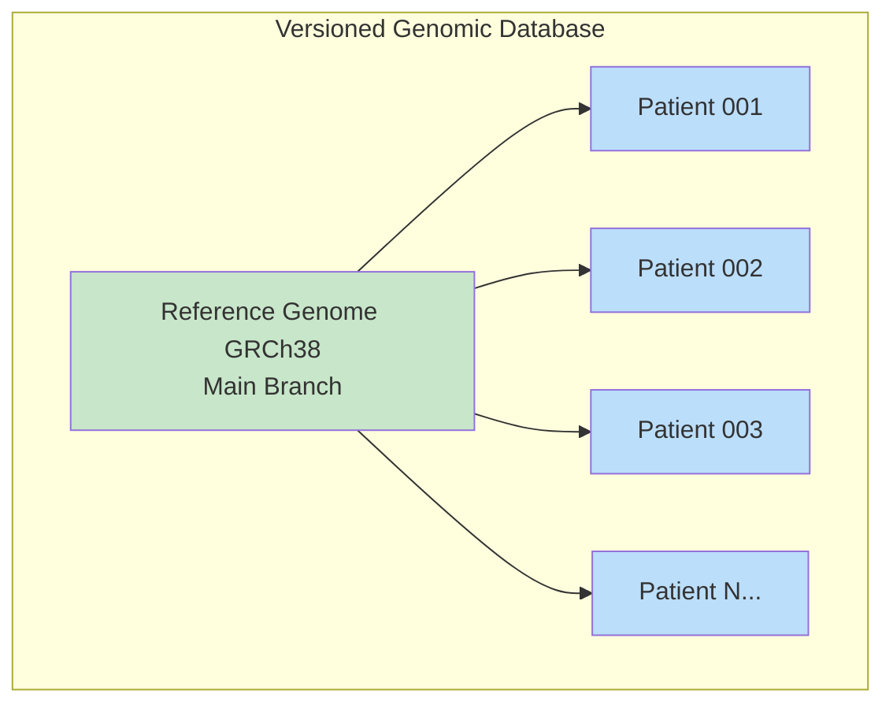
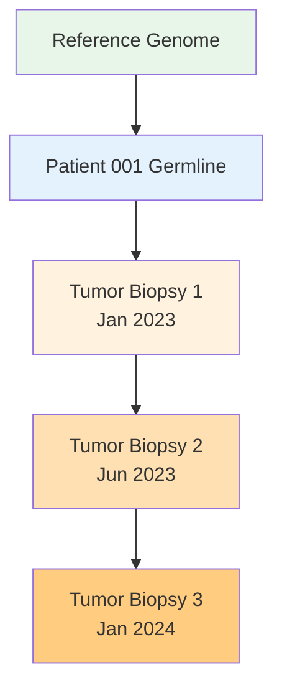

# A Database with Git Built-In (For Genomics)

## The Idea

I've been working on databases for a while, written a few from scratch. Most use B-trees as the main data structure (like Postgres, MySQL).

But recently I started working on a new kind of database that uses **Probabilistic B-trees** (Prolly-trees for short).

The key advantage: **the tree structure is deterministic**.

Same data == Same tree structure. Always.

This is NOT the case with regular B-trees:

```
Regular B-Tree:
Insert A, B, C  vs  Insert C, B, A
      [B]                 [B]
     /   \               /   \
   [A]   [C]           [A]   [C]
   
   Same data, but internal structure may differ.
   Can't compare by hash.

Prolly Tree:
ANY insertion order produces IDENTICAL structure.
Same data → Same hash → Can compare instantly.
```

## Why This Matters

If we have a deterministic data structure, we can add a **git graph on top of it**.

A database that can literally: `log`, `checkout`, `commit`, `diff`, `branch`, and `merge`.

A database with built-in git features.



## Why Is This Useful for Genetics?

You could have your **main branch set to the reference genome (GRCh38)** and all of your patients are **different branches** on the same database.



**What you can do:**

1. **Diff between patients** - Know the difference between genomes in O(k × log n) instead of O(n)

2. **Diff patient vs reference** - Instantly see all variants from GRCh38

3. **Track tumor evolution** - Each biopsy is a commit, full audit history preserved



4. **Fancy diffs** - Compare any patient to any other patient, any biopsy to any other biopsy

## How Diff Works (The Key Innovation)

When you change ONE thing, only the path to that change is affected:

```
Patient v1:                    Patient v2 (one variant changed):

      Root1                          Root2 (NEW)
     /     \                        /     \
    A       B          →           A       B' (NEW)
   / \     / \                    / \     / \
  L1  L2  L3  L4                 L1  L2  L3  L4' (CHANGED)
  ↑   ↑   ↑                      ↑   ↑   ↑
  └───┴───┴──────────────────────┴───┴───┘
         REUSED! Same hash = stored once
```

**To diff**: Compare hashes. Same hash? Skip entire subtree. Different? Recurse.

```
Traditional diff:  [████████████████████████████████] Compare ALL 5M positions
                
Prolly Tree diff:  [░░░░░░░░░░░░░░░░░░░░░░░░░░░░████] Compare only differences
                    ↑                            ↑
                    SKIPPED (same hash)          COMPARED
```

## Operational Complexity

Assuming you're currently comparing sequences by going through all characters:

| Operation                | Current Approach   | Prolly Tree Database      |
| ------------------------ | ------------------ | ------------------------- |
| **Store new patient**    | O(n) - write all   | O(k) - write diffs only   |
| **Diff two patients**    | O(n) - compare all | O(k × log n) - only diffs |
| **Commit (snapshot)**    | O(n) - copy all    | O(k) - new nodes only     |
| **Checkout (restore)**   | N/A                | O(1) - update pointer     |
| **Branch (new patient)** | O(n) - copy file   | O(1) - pointer only       |
| **Log (history)**        | N/A                | O(commits)                |

Where n = ~5 million variants, k = ~5,000 actual differences

**Diff speedup: 100-1000x**

## Storage Efficiency

Two humans share 99.9% of their DNA. The database exploits this:

```
Traditional: Each patient = complete copy
  10,000 patients × 500 MB = 5 TB

Prolly Tree: Reference + diffs only
  500 MB + (10,000 × 500 KB) = 5.5 GB

Reduction: ~1000x
```

## This Is Not Theoretical

I have a working prototype: https://github.com/0xlemi/microprolly

There are also mature projects doing the same thing: https://www.dolthub.com/

---

**The bottom line**: Genomic data is inherently versioned (reference + variants). This database architecture exploits that structure for massive efficiency gains in storage and comparison operations.
